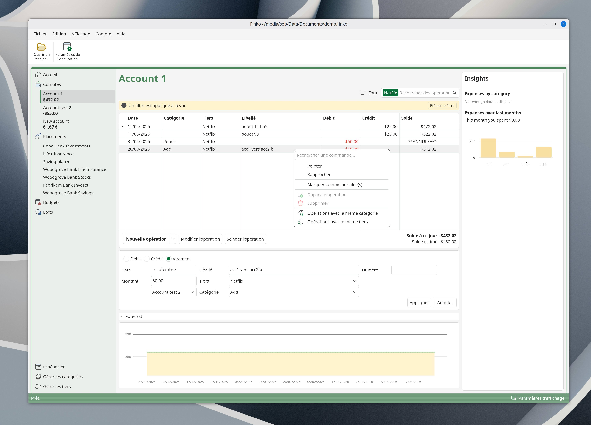

---
tags:
  - Free
  - Proprietary
  - Windows 10/11
  - Linux
---

# Introduction to Finko

Finko is currently in development.  
Finko is a free software to manage your personal finances and budget.  

It was created to rekindle the passion for Microsoft Money in the early 2000s.

Feel free to send error reports and ideas using the https://github.com/sebbouez/Finko/issues link.

Hope you'll enjoy using Finko as much as we enjoyed creating it.

Supported languages are English, French.