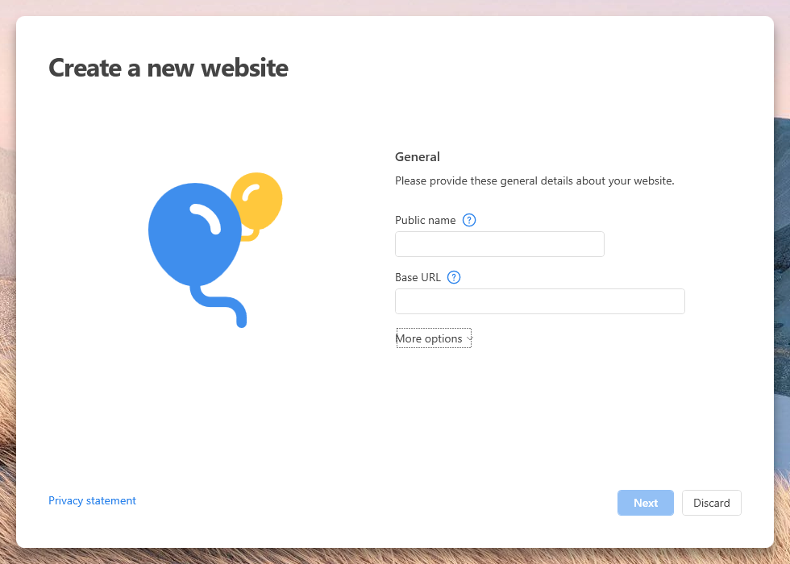
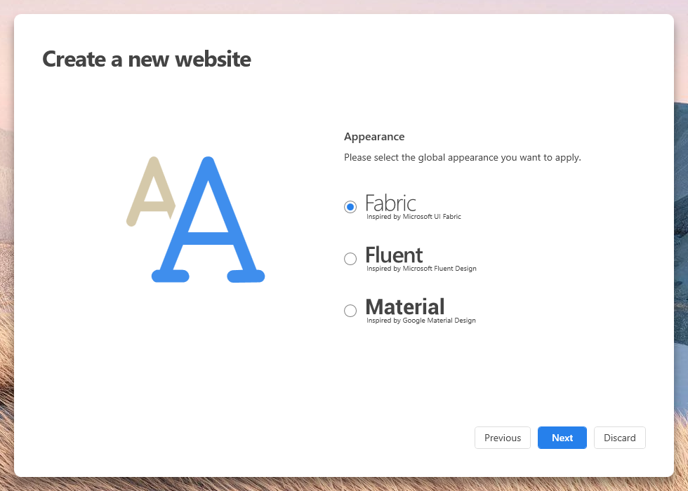
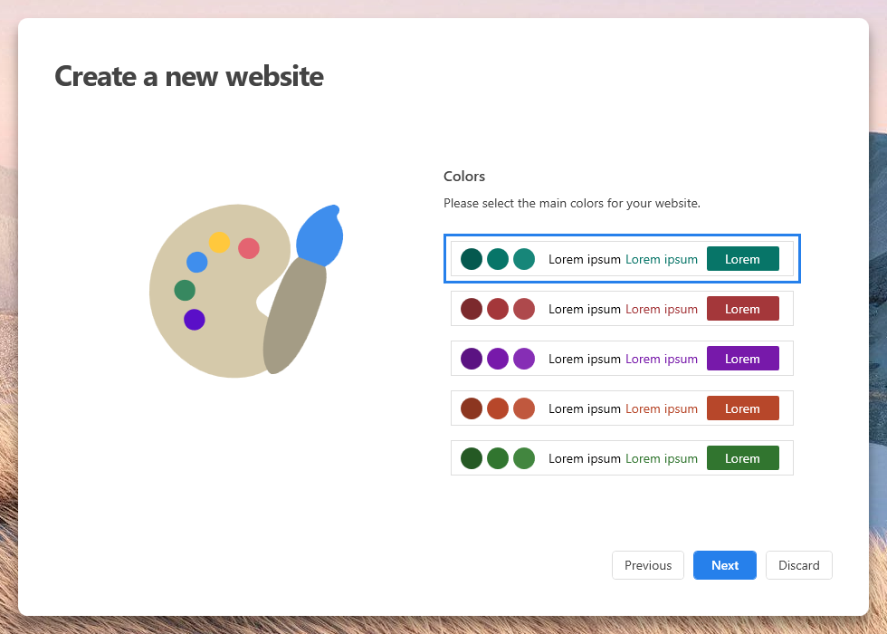
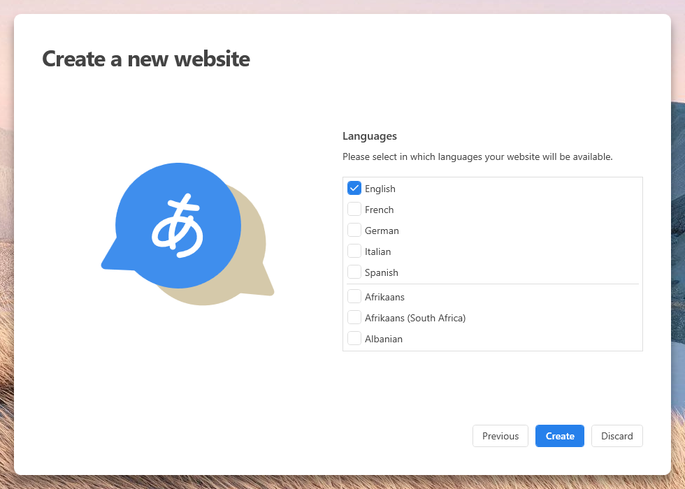

# Start a new Website with PageFabric

> [!IMPORTANT]
> This product is discontinued.  
> The documentation is available for historical purposes only.

To create a new Website with PageFabric, follow these steps:  
On the start screen, click the **Create new website** button.

## Page 1 – General settings

General information about your new website, such as the **public name**, the **base URL** (you can leave it empty).  
In the **More options** section, you can select the local directory to store the files.

> **Note:** Do not select a cloud-based directory to store your website files.  
> The sync process locks the files and may cause PageFabric not to work properly.  
> For example, avoid `OneDrive\` or `GoogleDrive\`.

## Page 2 – Appearance settings

The main appearance for your website.

## Page 3 – Color settings

The color theme for your website.

## Page 4 – Language settings

In which languages your website will be available.

When you are ready, click the **Create** button.
