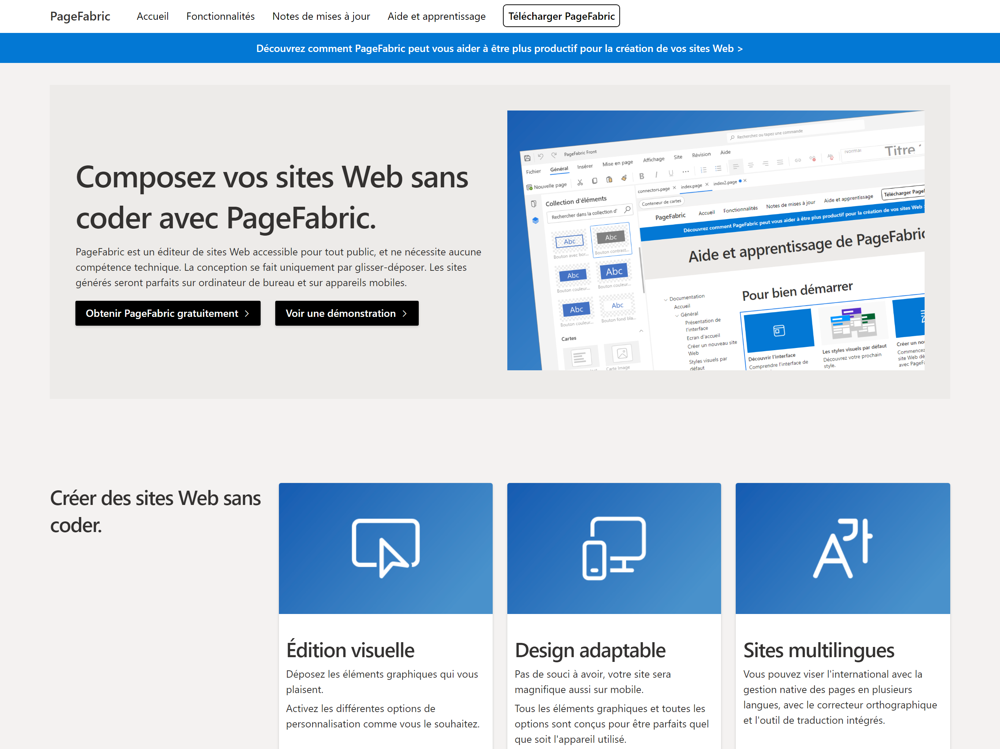
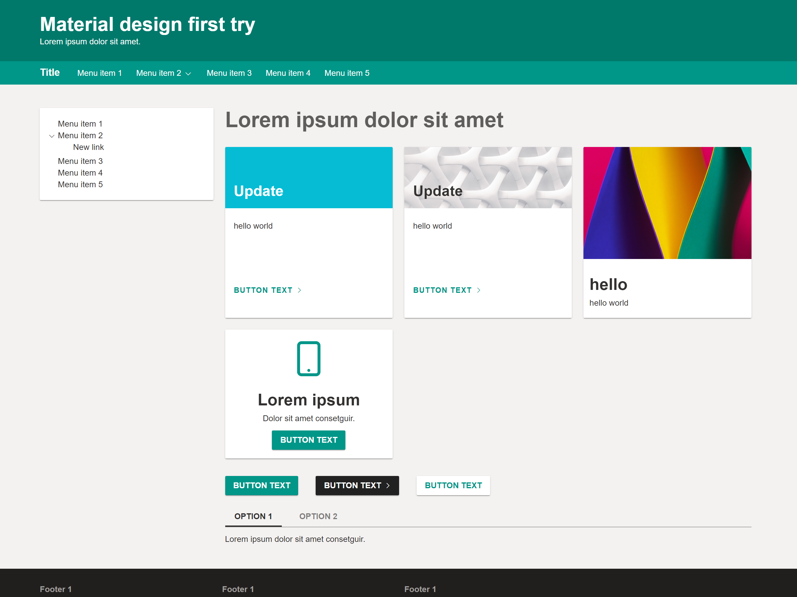

# Website visual themes in PageFabric

PageFabric comes out of the box with **three visual styles** inspired by Microsoft and Google.

***

## Fabric

Inspired by the Microsoft Grand Classique used in Windows 7.  
Headings are thin and boxes are flat.

***

## Fluent

Inspired by **Fluent Design**, the latest design language from Microsoft, used in Windows 10 and upcoming major products.  
Headings are bolder and various elevation effects are applied.  
Let’s not forget the beautiful **Acrylic effect**.

***

## Material

Inspired by **Material Design** from Google.  
It is used across various Google products — and of course, Android!
