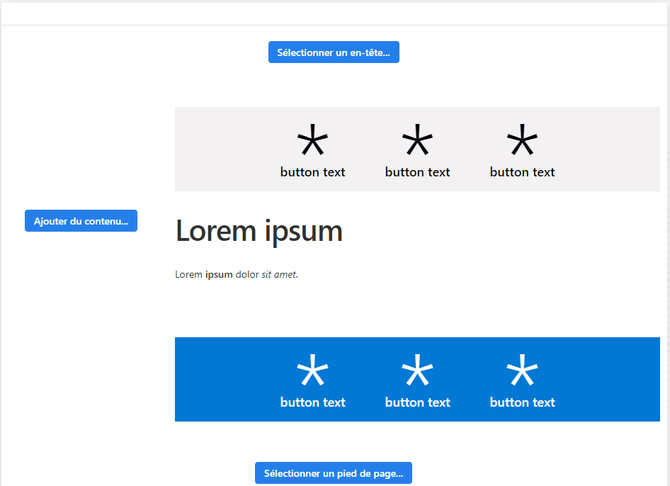
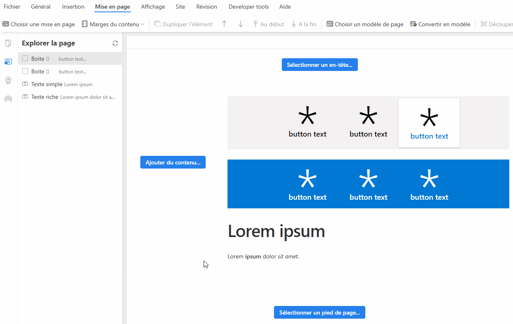
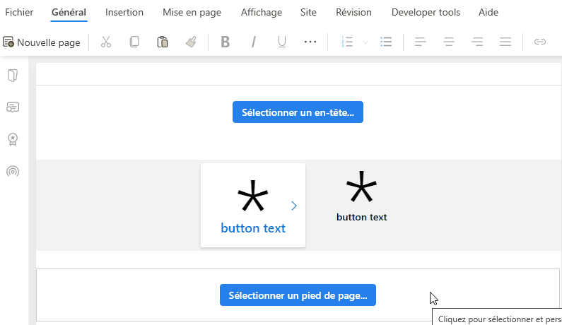

# Visual Designer

> [!IMPORTANT]
> This product is discontinued.  
> The documentation is available for historical purposes only.

PageFabric allows you to create beautiful pages very easily.  
When you start with a blank page, you have multiple areas to fill with custom content (depending on the [layout or template](page-layouts-templates.md) you select).

Add content to your page

1. Click the **“Add content”**, **“Select header”**, or **“Select footer”** buttons to start adding content in the different areas.
2. The **Insert Part** popup opens.
3. **Select the part** you want to insert. All parts are editable — if you can’t find exactly the one you want, pick the one that looks closest and adjust it later. You can type some words to filter the list.  
   From this popup, you can also insert an [extract from an existing page](insert-extracts.md) in the same website, or capture a screenshot of any currently running app.
4. Click the **Insert** button to add the selected part on your page.

When you already have parts on your page, the default buttons disappear.  
You can then add new parts between existing ones by moving your mouse over the spaces between them.  
When the **blue "+" button** appears, it means you can click to add something there.

## Reorder parts on your page

To move parts on your page, open the **Layout** tab in the ribbon.

- **Up** and **Down** arrows move the selected part one step up or down.
- **Move to top** and **Move to bottom** buttons move the selected part to the beginning or end of its parent.

The movement of elements is always relative to their parent.  
Here’s what happens when you use move actions on elements nested inside another element:

> **Note:**  
> You can use [keyboard shortcuts](shortcuts.md) to manipulate parts faster.

***

## Navigate in the page tree

All parts are made of nested elements.  
You can easily navigate through them by hovering your mouse over the **breadcrumb** above the designer area.  
Click an element in the breadcrumb to select and edit it.

## Cut, Copy, Paste, and Duplicate parts

Like any design application, you can easily cut, copy, and paste parts using the ribbon buttons or [keyboard shortcuts](shortcuts.md).

When you paste a part, it’s added **below** the selected element — the same applies when duplicating parts.

You can also use the **Special Paste** menu (right‑click on a part) to:

- Force paste **above** the current selection.
- Paste **inside** the current selection (if it supports nested elements).
- Force paste **below** the current selection.

The **Duplicate** operation creates an identical element in the same parent, right after the selected one.

## Paste formatting

When you want to apply the same style to another part, use the **Paste formatting** button in the ribbon.

1. Select the part whose style you want to copy.
2. Click the **Paste formatting** button.
3. Click the target part to apply the copied style.

