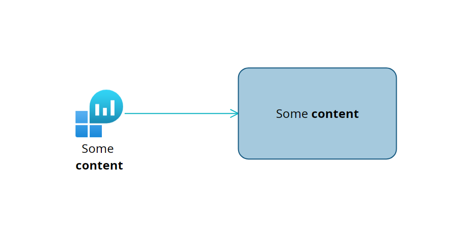

# Shapes

## Format

Use the **Shape format** panel to edit the shape's appearance.  

| Setting          | Description                                                    |
|------------------|----------------------------------------------------------------|
| Fill color       | The shape fill color.                                          |
| Border           | The shape stroke color.                                        |
| Line thickness   | The shape stroke width.                                        |
| Line style       | The style of line (solid, dotted...).                          |
| Start arrow type | For connections, sets the arrow type at the start of the path. |
| End arrow type   | For connections, sets the arrow type at the end of the path.   |
| Opacity          | Sets the opacity of the shape.                                 |

## Content

Shapes can contain text. Text supports basic formulas.
Learn more about the supported formulas in the [Vista Developers Guide](../../dev/vista/index.md) section.

### Content formatting

Shapes text support basic markdown formatting.

```md
You can write **bold** text.
You can write *italic* text.
You can write __underline__ text.
You can write ~~strikethrough~~ text.
```

### Content alignment

Basic shapes will show content inside, whereas SVG based shapes will show content outside.  
See the following example:  
