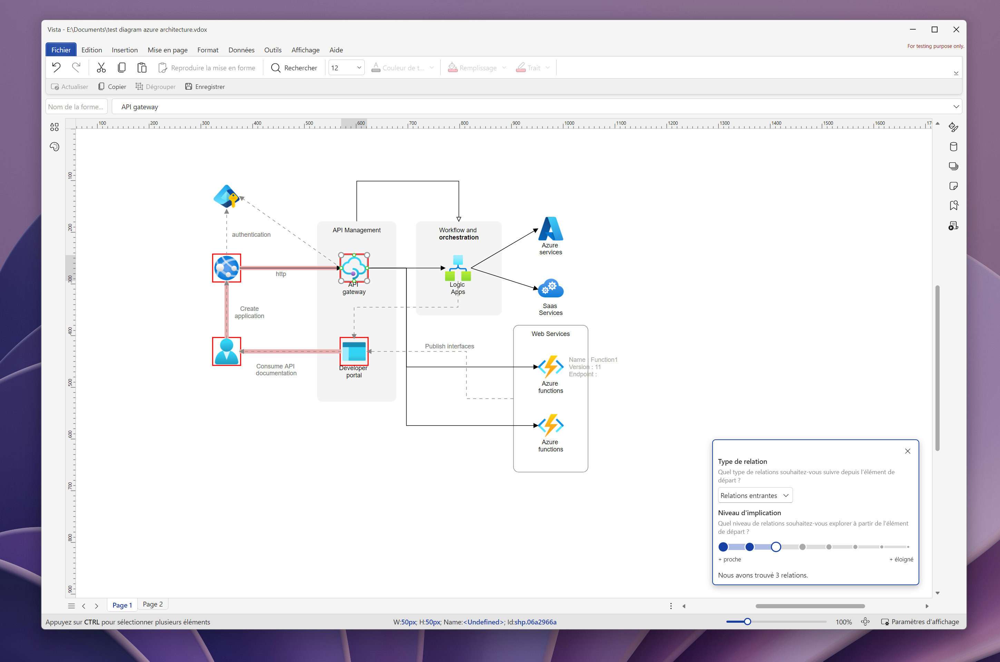

# Spotlight

Spotlight is a feature that allows you to get quick visual insights from your diagrams.    
It is particularly useful when you draw large and complex diagrams.   

## Explore relations between shapes

There are many scenarios in which you may want to explore the relations between shapes.  
This is where the Spotlight feature comes in.

1. Select the shape you want to explore.
2. Select the  **Tools > Spotlight** menu (or right-click on the selected shape, then select **Spotlight**)
   1. Select **Identify incoming relations...** to explore shapes that have an incoming relation to the selected shape.
   2. Select **Identify outgoing relations...** to explore shapes that have an outgoing relation from the selected shape.

In the **Spotlight** dialog, you can change the **Implication level** to explore more or less complex relations. 

